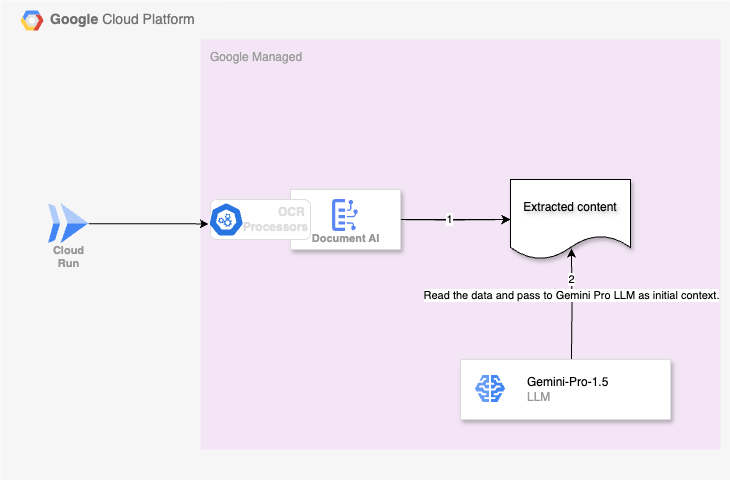

# Gemini 1.5 Pro model

Testing out gemini 1.5 models' capability for 1M token context length. 
- Extract the contents of the PDF using Google Document AI API to extract the contents.
- Additional premium features enabled to extract the mathematical formulas in Latex typesetting. 
- The extracted data is then passed to Gemini 1.5 pro model using Vertex AI APIs(which has context size of 1M) and then ask subsiquent questions based on the context provided.

